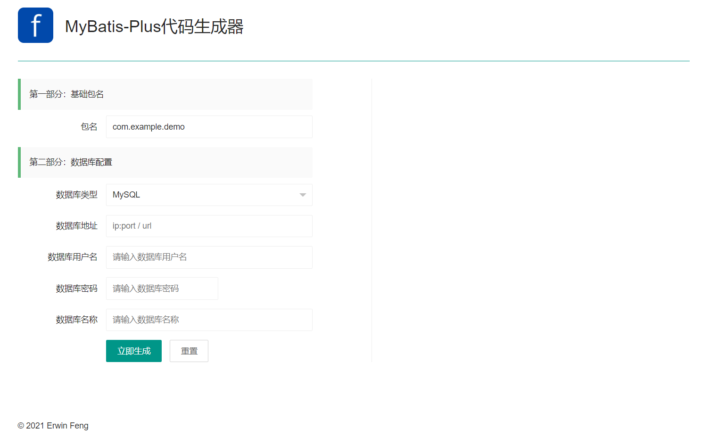
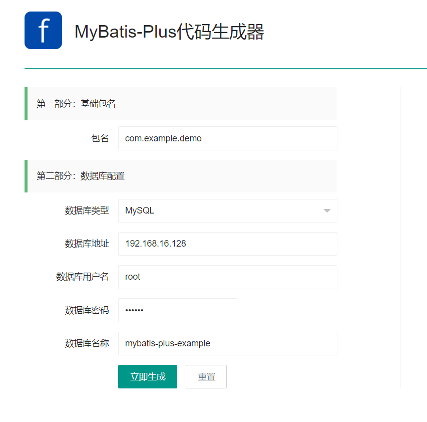
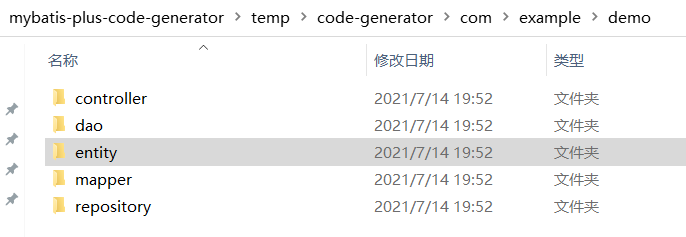

# MyBatis-Plus 代码生成器

## Current Version

3.4.1

## 概述

代码生成器，又被叫做逆向工程，MyBatis官方为了推广，自己也写了一个，我之前也使用这个，功能也是非常强大，强大以为支持自定义配置，那么问题来了，我该怎么配置才合理呢，所以，有人把所有的配置项都弄成中文的，还有人开发了生成插件，这些在我以往的博文中都看看到。MyBatis-Plus的代码生成器到底怎么样，这我就不评判了，我就这样说，用用看吧。

**功能列表：**

* [x] 自动生成model类

* [x] 自动生成dao接口

* [x] 自动生成xml文件

* [x] 自动生成service接口
 
* [x] 自动生成service实现类

* [x] model支持Builder模式

* [x] 支持swagger2

* [x] 支持生成数据库字段常量

* [x] 支持生成Kotlin代码

* [x] ……more……

## 使用指南

### 启动项目

#### 方案一

将项目git clone到本地，运行即可。

#### 访问

> http://localhost:8080

### 生成代码

#### 填写表单信息

#### 生成代码

