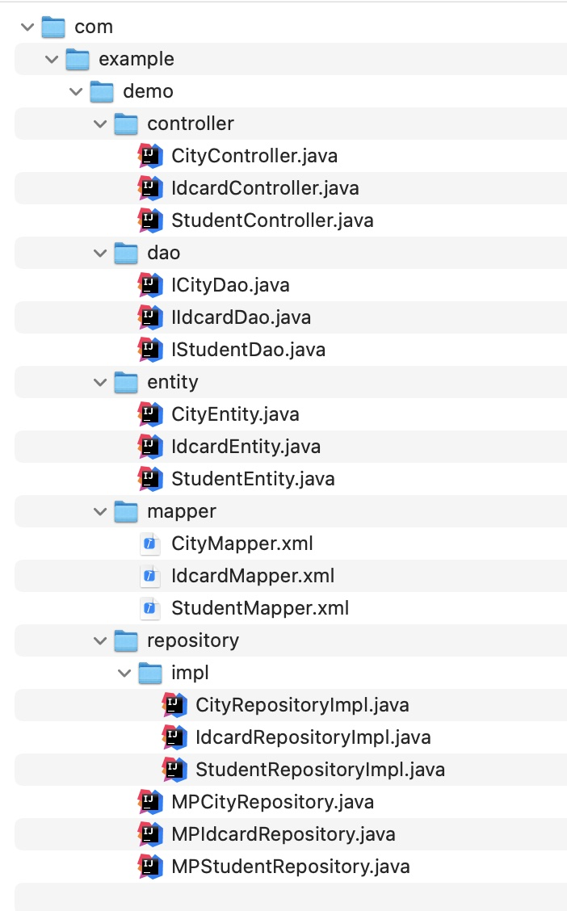
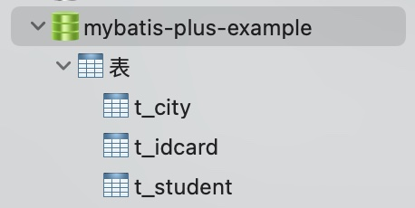

# MyBatis-Plus 代码生成器

## Current Version

3.5.4.1-2

说明： 除最后一位，前面的为mybatis-plus-generator的版本号，最后一位为该版本迭代次数。


## 概述

代码生成器，又被叫做逆向工程，MyBatis官方为了推广，自己也写了一个，我之前也使用这个，功能也是非常强大，强大以为支持自定义配置，那么问题来了，我该怎么配置才合理呢，所以，有人把所有的配置项都弄成中文的，还有人开发了生成插件，这些在我以往的博文中都看看到。MyBatis-Plus的代码生成器到底怎么样，这我就不评判了，我就这样说，用用看吧。

**功能列表：**

* [x] 自动生成model类

* [x] 自动生成dao接口

* [x] 自动生成xml文件

* [x] 自动生成service接口
 
* [x] 自动生成service实现类

* [x] model支持Builder模式

* [x] 支持swagger2

* [x] 支持生成数据库字段常量

* [x] 支持生成Kotlin代码

* [x] ……more……

## 使用指南

### 启动项目

#### 方案1: jar

下载：[mybatis-plus-code-generator-3.5.4.1-2.jar](https://github.com/fengwenyi/mybatis-plus-code-generator/releases/download/3.5.4.1-2/mybatis-plus-code-generator-3.5.4.1-2.jar)

运行:

```shell
java -jar mybatis-plus-code-generator-3.5.4.1-2.jar
```

#### 方案2: docker

```shell
# 拉取镜像
docker pull fengwenyi/mybatis-plus-code-generator

# 启动服务
docker run -d -p 8899:8899 --name code-generator -v ~/temp:/temp fengwenyi/mybatis-plus-code-generator

# 查看日志
docker logs -f code-generator

# 进入容器
docker exec -it code-generator sh
# or
docker attach code-generator
```

挂在目录说明：

> ~/temp:/temp

冒号前面为挂在的目录，你这个自定义，比如：e:/temp。

冒号后面为docker容器目录。

#### 方案3: git clone

将项目git clone到本地，运行即可。


#### 访问

> http://localhost:8899

访问上面地址，你就会看的如下高端、大气、上档次的界面了。


### 生成代码

#### 填写表单信息

必填的主要有两部分，包名和数据库连接信息配置。

这里的包名，指的是，生成的数据库相关的类，要放在哪个包下面。


#### 生成代码

会生成如下文件：



数据库表如下：




## 其他

[更新日志](LOG.md)


忽略的字段：

```
id
create_date_time
update_date_time
status

create_user_id
create_user_name
update_user_id
update_user_name
enabled_state
deleted_state
```

## 问题

- docker本机部署，数据库也在本地，数据库连接地址不能是localhost或者127.0.0.1，要填本机IP